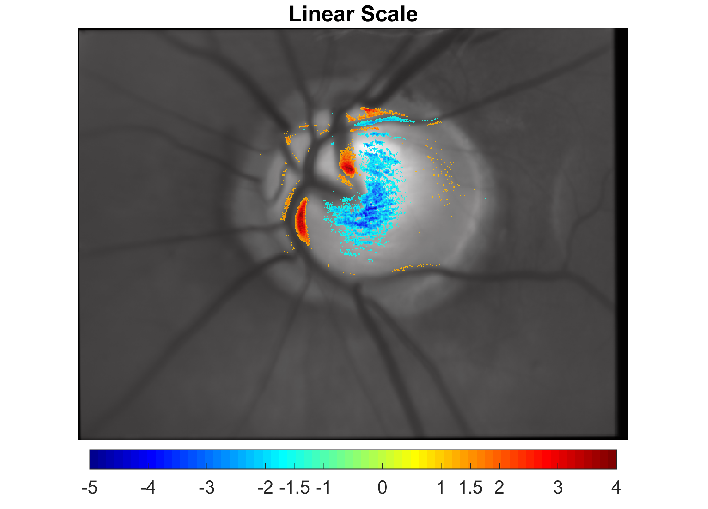

# showmap
Matlab code for vizualization of 2D statistical parametric map in linear or logaritmic scales over 2D background image.

Cite as:

Labounkova Ivana, Labounek Rene, Nestrasil Igor and Kolar Radim(2020). showmap, GitHub. URL: https://github.com/ivanalabounkova/showmap

